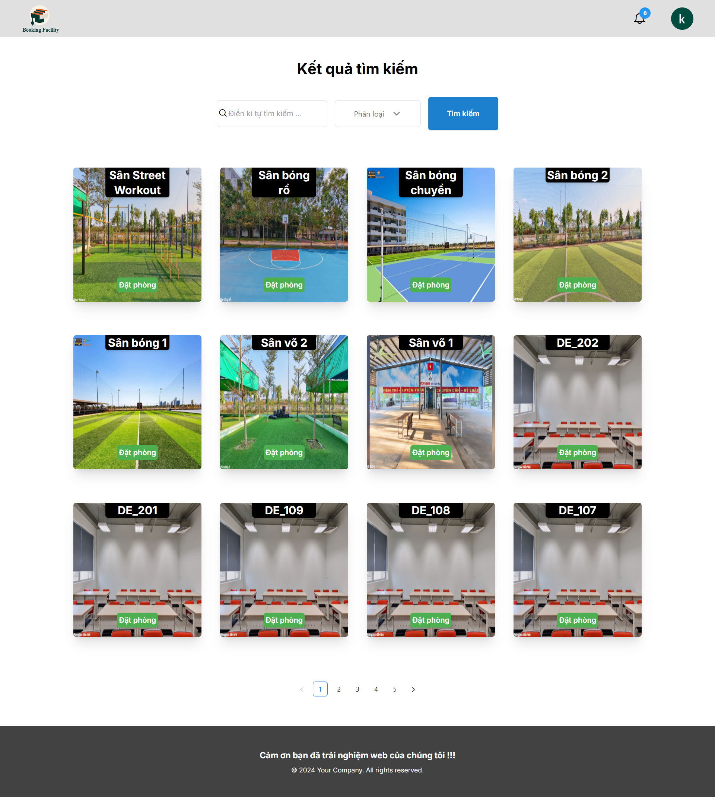
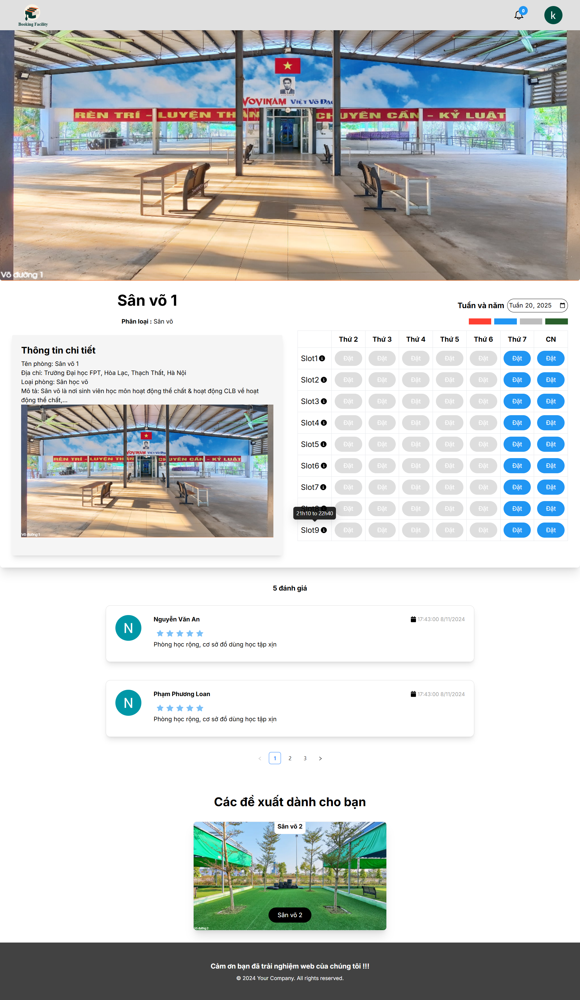
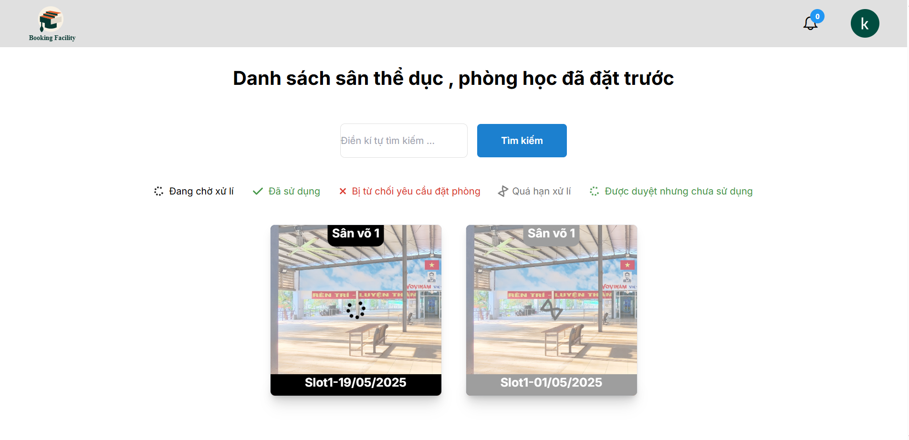
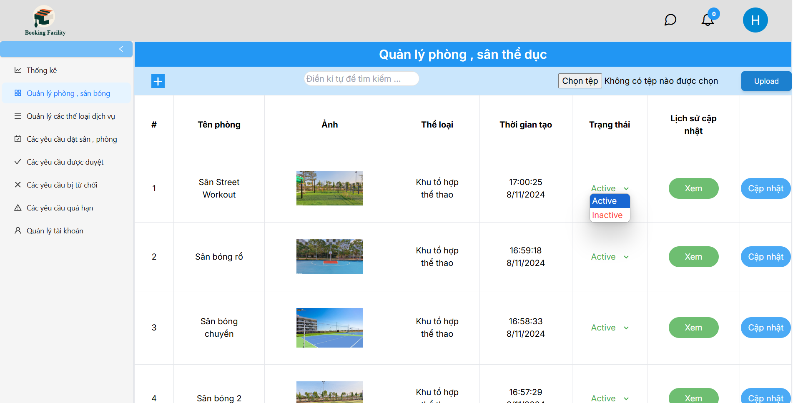
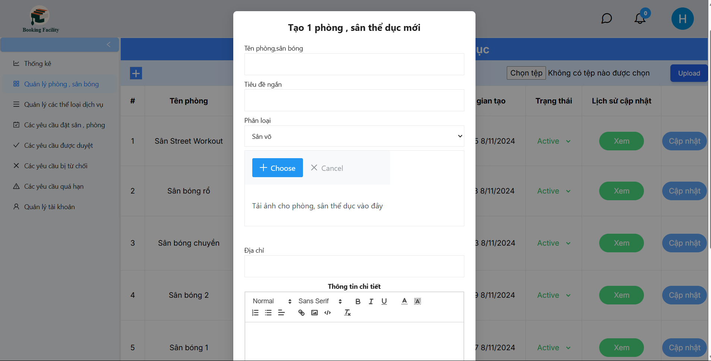
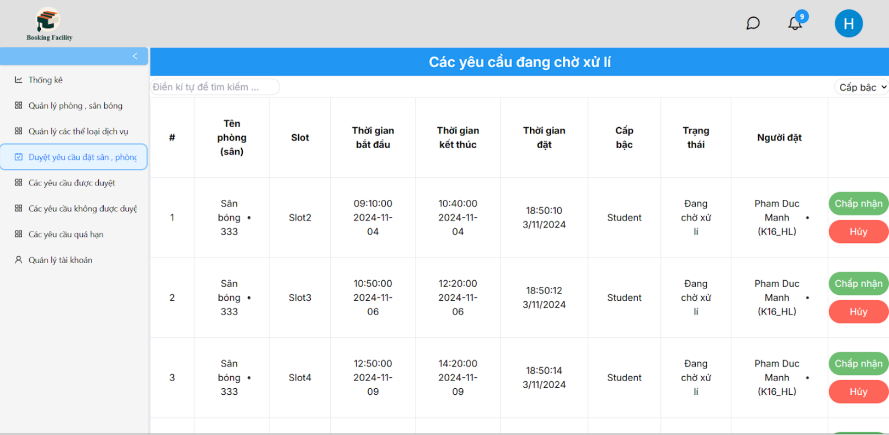
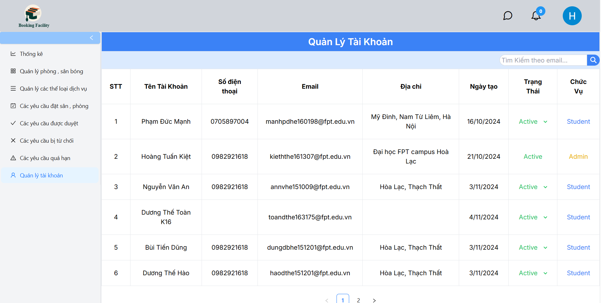
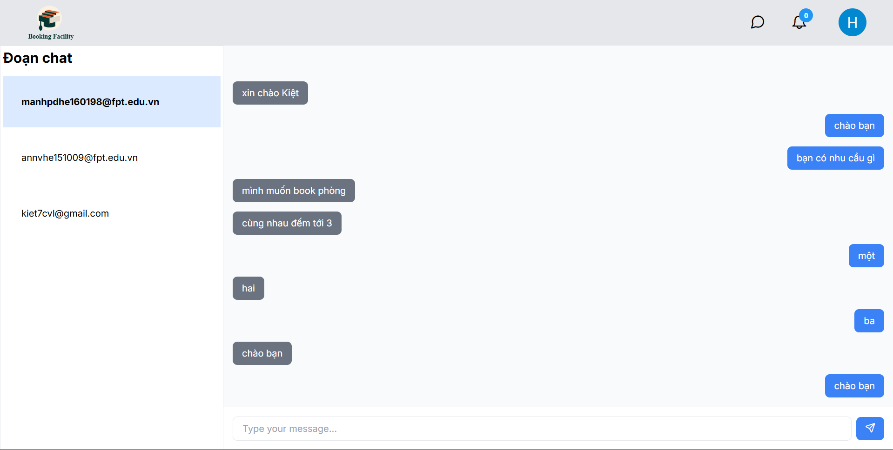

# Facility-Management-System
FPT school facility management system, scheduling, facility rental, management,...

# 🛠️ Technology
### Frontend:
- TypeScript
- Next.js 
- TailwindCSS
- Axios, Socket.IO
- Redux

### Backend:
- Node.js (Express)
- MongoDB + Mongoose
- JWT Authentication
- Multer, Cloudinary

## 🔐 Main features

### User:
- Register, login, authenticate JWT
- Review facilities and track slot booking schedule
- Create booking request
- View booking history and status
- Cancel or edit booking (if not approved)
- Rate, comment after use
- Realtime messaging

### Administrator:
- Manage categories, facilities,
- Track usage statistics
- Manage user booking schedules
- Manage user accounts
- Real-time messaging

## 📸 Screenshot

- Users can login to the system by clicking on “Đăng nhập”, users will go to the login page and login to the system by google account with FPT email.

- After login, user will be navigated to homepage
In the home page, users will see the list of categories, top 8 of facilities

- When click in a category, it will facilities list of the category

- When you click on a specific facilities, you will be navigated to the facilities detail page

- Select “Lịch sử đặt phòng” to view all of booking request and their status. You can search facilities by name in here

- Users login to the system with an account with the role “Admin”. Users can see the Dashboard for “Admin”.

- Click “Quản lý phòng, sân bóng” to view facilities list

- From facilities list page Admin can create, update , change status and view history log

- Click “Quản lý thể loại, dịch vu” to view category list, create, update , view history log like in the facility

- Click “Quản lý yêu cầu đặt phòng” to view request list, in here Admin will handle 
requests from users: Approved or Reject 

- Click “Quản lý người dùng” to view user list, Admin can view all user account and can inactive it

- Click messeage icon in the header to go to chat screen, Admin can chat realtime with many users

