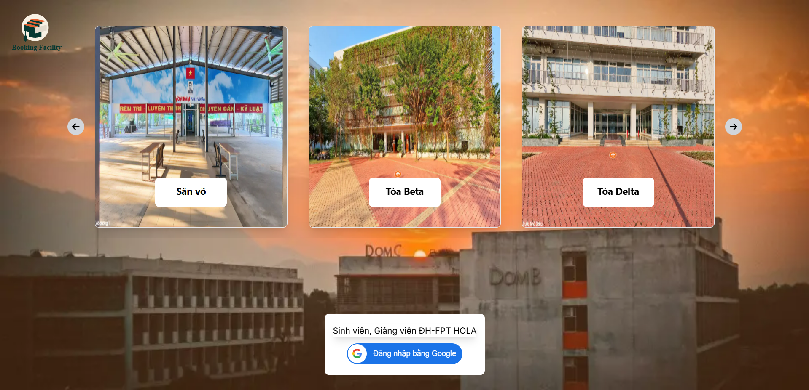

# Facility-Management-System
FPT school facility management system, scheduling, facility rental, management,...

# 🛠️ Technology
### Frontend:
- TypeScript
- Next.js 
- TailwindCSS
- Axios, Socket.IO
- Redux

### Backend:
- Node.js (Express)
- MongoDB + Mongoose
- JWT Authentication
- Multer, Cloudinary

## 🔐 Main features

### User:
- Register, login, authenticate JWT
- Review facilities and track slot booking schedule
- Create booking request
- View booking history and status
- Cancel or edit booking (if not approved)
- Rate, comment after use
- Realtime messaging

### Administrator:
- Manage categories, facilities,
- Track usage statistics
- Manage user booking schedules
- Manage user accounts
- Real-time messaging

## 📸 Screenshot

